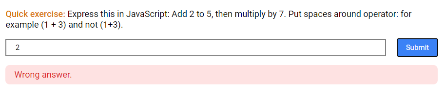
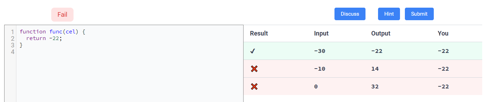

## Screenshots, Input & Output
This page contains screenshots, input & output of:

**Account Module**

* Login
* Registration

<br>

**Tutorial Editor Module**

* [Lesson Editor](https://github.com/maxosen/codinglab-1/blob/main/documentation/input-output.md#lesson-editor)
* Exercise Editor

<br>

**Tutorial and Exercise Module**

* Lesson
* Exercise

<br>

**Feedback, Behaviour and Analytics Module**

* Feedback Form
* Analytics

## Account Module
### Login


Login form

<br>


Sample inputs for login form

**Expected Input**

1. Username `String`
2. Password `String`
3. Role: `String`

**Input Validation**

Username, Password, and Role must match the Username, Password, and Role of a User record in the PostgreSQL database
* This rule is enforced through authentication operation on the application server.

**Expected Output**

A `User` object with matching username and password.

### Registration


Registration form

<br>


Sample inputs for login form


Sample invalid inputs for login form

**Expected Input**

1. User name: `String`
2. First name: `String`
3. Last name: `String`
4. Password: `String`
5. Repeated Password: `String`
6. Role: `String`
7. Phone Number: `String`
8. Photo: `Image`

**Input Validation**

All fields must not be empty.
* Enforced at HTML form validation, and database level.

Password must match Repeated Password.
* Enforced in business logic (at application server).

Role must be a specific string: either "Student" or "Instructor".
* Enforced at HTML form validation, and database level.

Email address must be in a valid email format.
* Enforced at HTML form validation.

**Expected Output**

* A new row in `User` PostgreSQL table.
* A new row in `StudentProfile` or `InstructorProfile` PostgreSQL table.

## Tutorial Editor Module
### Lesson Editor


Form / Editor for creating a lesson

<br>


Sample Inputs for creating a lesson

**Expected Input**

1. Title:  `String`
2. Order: `Integer`
3. Content: `String`
4. Question: `String`
5. Answer: `String`

**Invalid Input**

Order must be an `Integer`
* This rule is enforced by HTML input field validation, and at the database level.

**Expected Output**

A new row `Lesson` in PostgreSQL that consists of following columns with following data types:

1. ID `PRIMARY KEY`
2. Tutorial `FOREIGN KEY`
3. Title `VARCHAR`
4. Order `INTEGER`
5. Markdown `TEXT`
6. Exercise Question `TEXT`
7. Exercise Answer `TEXT`
8. Date Created `DATE`

```python
class Lesson(models.Model):
    tutorial = models.ForeignKey(Tutorial, on_delete=models.CASCADE)
    title = models.CharField(max_length=400)
    order = models.IntegerField()
    markdown = models.TextField()
    exercise_question = models.TextField(blank=True)
    exercise_ans = models.TextField(blank=True)
    date_created = models.DateField(auto_now_add=True)
```

### Exercise Editor


Form / Editor for creating an exercise

<br>


Sample Inputs for creating an exercise

## Tutorial and Exercise Module
### Lesson Quick Exercise


Exercise Question for a lesson

<br>



Sample input for a lesson

**Expected Input**

1. Answer `String`

**Input Validation**

None.

**Expected Output**

Result of the answer.

### Programming Exercise


Programming Exercise Question

<br>



Sample input for a programming exercise

**Expected Input**

1. Answer `String`

**Input Validation**

None.

**Expected Output**

Result of the answer.

## Feedback, Behavior and Analytics Module
### Feedback


Feedback form

<br>


Feedback form sample input

**Expected Input**

1. Difficulty rating `Integer`
2. Feedback `String`

**Input Validation**

Difficulty rating must be an integer.
* Enforced at HTML form validation level, and database level.

**Expected Output**

A new row in the `LessonFeedback` or `ExerciseFeedback` PostgreSQL table.

```python
class LessonFeedback(models.Model):
    lesson = models.ForeignKey(Lesson, on_delete=models.CASCADE)
    assignment = models.ForeignKey(Assignment, on_delete=models.CASCADE)
    feedback = models.TextField()
    rating = models.IntegerField()


class ExerciseFeedback(models.Model):
    exercise = models.ForeignKey(Exercise, on_delete=models.CASCADE)
    assignment = models.ForeignKey(Assignment, on_delete=models.CASCADE)
    feedback = models.TextField()
    rating = models.IntegerField()
```